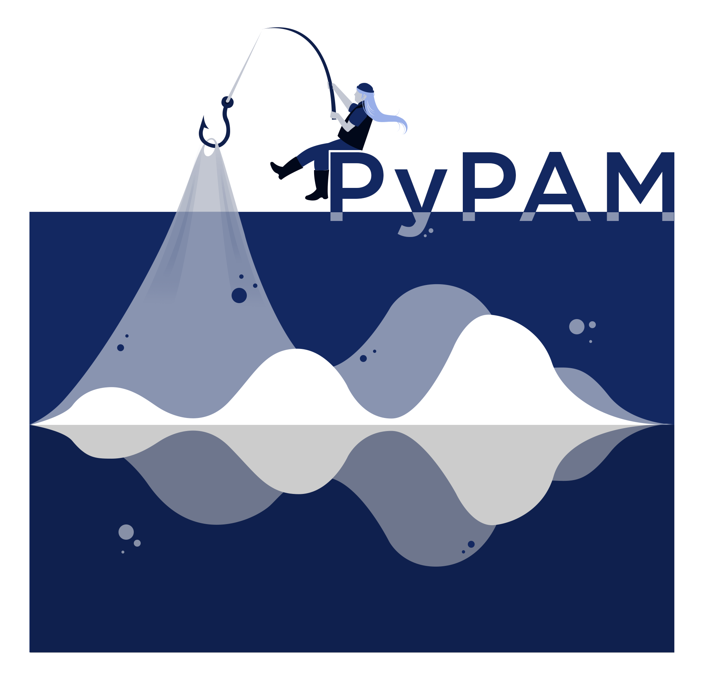

<h1 align="center">

</h1><br>

[](https://github.com/lifewatch/pypam/actions/workflows/ci.yml)
[](
https://pypi.org/project/lifewatch-pypam/)
[](https://doi.org/10.5281/zenodo.6044593)


`pypam` is a python package to analyze underwater sound. 
It is made to make easier the processing of underwater data stored in audio files in chunks. 
The main classes are AcousticFile, AcousticSurvey and DataSet. The first one is a representation of an audio file 
together with all the metadata needed to process the data (such as hydrophone used). 
The second one is the representation of a folder where all the files are stored for one deployment. 
Here we consider a deployment as a measurement interval corresponding to the time when a hydrophone was in the water, 
without changing any recording parameters.
The Dataset is a combination of different AcousticSurveys in one dataset. This is to be used if the user has made 
several deployments and wants to process them with the same parameters.

Then `pypam` allows to go through all the audio files from the deployments only with one line of code and store 
the output in netCDF files, including metadata. The package can be used to analyze a single file, 
a folder with files or a group of different deployments. 
`pypam` deals with the calibration directly, so the output obtained is already in uPa or dB! 


All the documentation can be found on [readthedocs](https://lifewatch-pypam.readthedocs.io)

> **Warning**
> This package is under active development, use with caution.


## Installation
### Using pip distribution 
```bash
pip install lifewatch-pypam
```

### Using git clone

1. Clone the package
    ```bash
    git clone https://github.com/lifewatch/pypam.git
    ```
2. Use poetry to install the project dependencies
    ```bash
    poetry install
    ```
3. Build the project
    ```bash
    poetry build
    ```

## News from version 0.3.0
In version 0.2.0 we removed the detectors, because there are better maintained packages for these purposes. 
In version 0.2.1 we added the frequency-dependent calibration! 
In version 0.3.0 we changed quite some plot function to make them more flexible with other data products. 
We also changed the mean functions to median, so the output in db is the same than the output in uPa

## Quickstart
The package is imported as `pypam`. The audio file names must comply with the needs of 
[pyhydrophone](https://github.com/lifewatch/pyhydrophone) to be able to read the datetime information. 

The user can choose a window chunk size (parameter binsize, in seconds), so all the features / methods 
are applied to that window. If set to None, the operations are performed along an entire file.

The available methods and features are: 
- Acoustic Indices: 
  - ACI 
  - BI 
  - SH 
  - TH 
  - NDSI
  - AEI 
  - ADI 
  - Zero crossing (average)
  - BN peaks 
- time-domain features: 
  - rms 
  - dynamic_range
  - sel
  - peak 
  - rms_envelope
  - spectrum_slope
  - correlation coefficient
- frequency-domain 
  - spectrogram (also octave bands spectrogram)
  - spectrum (density or power)
  - 1/n-octave bands
  - hybrid millidecade bands
  - long-term spectrogram
- time and frequency 
  - SPD


Futhermore, there are several plotting functions
- SPD
- spectrum with standard deviation 
- boxplots of time series aggregated data 
- daily patterns 
- LTSA


and some signal-based operations:
- Signal operations
   - Noise reduction 
   - Downsample 
   - Band filter 
   - Envelope
   - DC noise removal

## pypam to the next level 
pypam-based-processing (PBP) is a repository which acts as a wrapper for pypam to make its use to compute hybrid millidecade
bands a lot more effective.
PBP allows for local or cloud computing.
For more information, you can find it in this [repository](https://github.com/mbari-org/pypam-based-processing). 


## Examples and documentation
See the documentation in [readthedocs](https://lifewatch-pypam.readthedocs.io) for a complete reference manual and 
example gallery. 

In this [collection of notebooks](https://github.com/ioos/soundcoop), some extra examples can be found of how 
to use pypam (under development).

## Under development 
Planned:
- Add function to generate files per included folder (too big deployments)
- Add options for the user to choose what to do when the blocksize is not multiple of the frames, 
and to deal with time keeping
- Add a logger that logs the code that was run and the warnings together with the output
- Add deep learning feature extraction (vggish and compatibility with koogu and AVES)
- Add parallel processing options 
- Add support for frequency calibration
- Support for reading detections 


## Cite
> Parcerisas, C. (2023). PyPAM: a package to process long-term underwater acoustics data in chunks (0.3.0). Zenodo. https://doi.org/10.5281/zenodo.10037826

