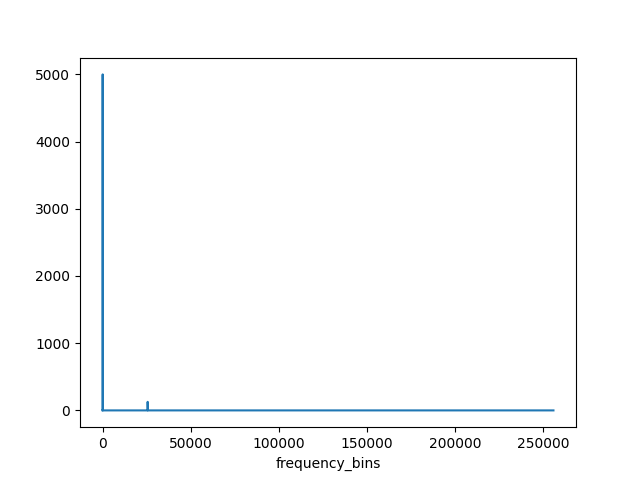

<!--
 DO NOT EDIT.
 THIS FILE WAS AUTOMATICALLY GENERATED BY mkdocs-gallery.
 TO MAKE CHANGES, EDIT THE SOURCE PYTHON FILE:
 "examples/plot_signal_oriented.py"
 LINE NUMBERS ARE GIVEN BELOW.
-->

!!! note

    Click [here](#download_links)
    to download the full example code


Signal oriented processing
==========================

This script is an example to use a lower level of pypam by directly working with the Signal class, and computing
the hybrid millidecade bands for it.

<!-- GENERATED FROM PYTHON SOURCE LINES 11-63 -->


{: .mkd-glr-single-img srcset="../images/mkd_glr_plot_signal_oriented_001.png"}

Out:
{: .mkd-glr-script-out }

```{.shell .mkd-glr-script-out-disp }
C:/Users/cleap/Documents/code/pypam/examples/plot_signal_oriented.py:62: UserWarning: FigureCanvasAgg is non-interactive, and thus cannot be shown
  plt.show()

```


<br />

```{.python }


import numpy as np
import xarray
import matplotlib.pyplot as plt

import pypam.utils as utils
import pypam.signal as sig

plt.rcParams.update(plt.rcParamsDefault)

N_CHUNKS = 5

# Create artificial data of 1 second
fs = 512000
test_freqs = [400, fs / 4]
samples = fs * N_CHUNKS
noise_amp = 100
signal_amp = 100
data = np.random.random(samples)
t = np.linspace(0, 1 - 1 / fs, samples)
phase = 2 * np.pi * t
for test_freq in test_freqs:
    data = data + signal_amp * np.sin(test_freq * phase)
# Set the nfft to 1 second
nfft = fs

# Loop through all your chunks
list_spectras = []
for i in np.arange(N_CHUNKS):
    s = sig.Signal(data, fs=fs)
    s.set_band(None)
    fbands, spectra, _ = s.spectrum(
        scaling="spectrum", nfft=fs, db=False, overlap=0, force_calc=True
    )
    list_spectras.append(spectra)

# Convert the spectra to a datarray
psd_da = xarray.DataArray(
    list_spectras,
    coords={"id": np.arange(N_CHUNKS), "frequency": fbands},
    dims=["id", "frequency"],
)

# Get the millidecade bands
bands_limits, bands_c = utils.get_hybrid_millidecade_limits(band=[0, fs / 2], nfft=nfft)
milli_psd = utils.spectra_ds_to_bands(
    psd_da, bands_limits, bands_c, fft_bin_width=fs / nfft, db=False
)

milli_psd.mean("id").plot()
plt.show()
```


**Total running time of the script:** ( 0 minutes  1.659 seconds)

<div id="download_links"></div>


[:fontawesome-solid-download: Download Python source code: plot_signal_oriented.py](./plot_signal_oriented.py){ .md-button .center}

[:fontawesome-solid-download: Download Jupyter notebook: plot_signal_oriented.ipynb](./plot_signal_oriented.ipynb){ .md-button .center}


[Gallery generated by mkdocs-gallery](https://smarie.github.io/mkdocs-gallery){: .mkd-glr-signature }
